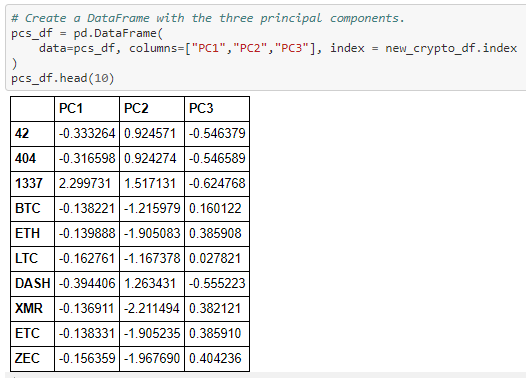
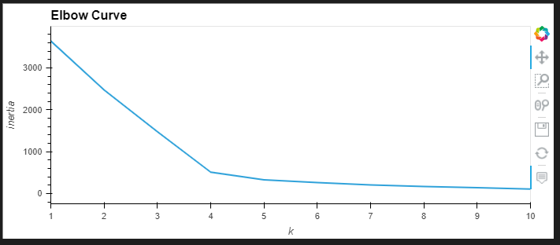
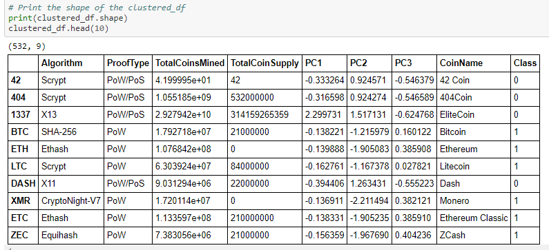
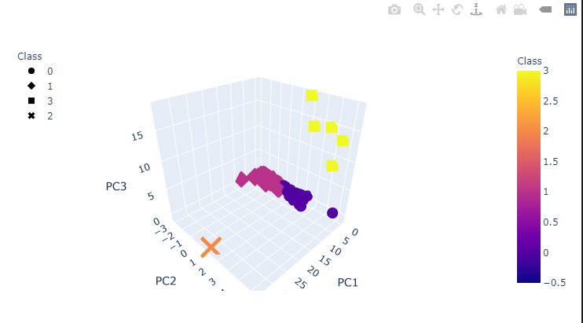
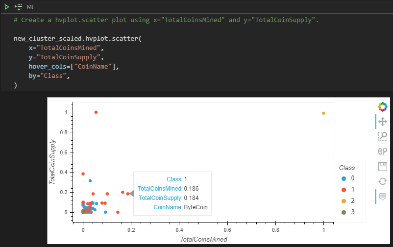
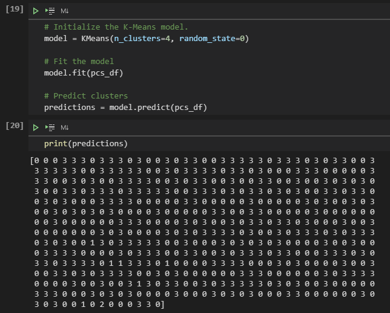

# Cryptocurrencies

## Purpose

The purpose of this challenge was to apply what we've learned about **unsupervised machine learning** and how it applies to the cryptocurrency market. Throughout the module,
we learned how to process data, how to cluster, how to reduce our dimensions and how to create the principal components using PCA. As such, the intent is to the apply these skills to the challenge. The goal is to "create a report that includes what cryptocurrencies are on the trading market and how they could be grouped to create a classification system for [a new investment]".

## Analysis/Results

The crypto data was retrieved from https://min-api.cryptocompare.com/data/all/coinlist and it's essentially not ideal as it will need to be processed to fit the machine learning models. In addition, "there is no known output for what Martha is looking for", which explains the approach towards using unsupervised learning. 

Stepping through the deliverables, we will: 

- **Deliverable 1**: Preprocess the data to be used for a Principal Component Analysis (PCA). This is typically used for machine learning when the number of input features/dimensions are too high. *(Module location: 18.5.2)* In the preprocessing phase, it's a matter of cleaning up the data by dropping any unnecessary columns or rows that are nulls.

- **Deliverable 2**: Reduce the data dimensions using PCA. By using PCA, the data will be trimmed to three principal components.  
      *The following shows the dataframe created with the three principal components:* 

- **Deliverable 3**: Clustering Crytocurrencies using K-Means. In order to group the cryptocurrencies, a clustering algorithm was choosen. In order to find the best value for K, an elbow curve was generated:  
  
Running our K-Means model into 4 clusters, the model is then set to be fitted, and ran through for predictions. Thereafter, a new dataframe is created to reflect the data into clusters/class: 
 
 
- **Deliverable 4**: Finally, to share the findings, the aim for this section was to report the cryptocurrency results visually.  Using 3D-Scatter of the PCA data and the clusters, it plots the three principal components on the graph by it's different classes.
  
Further, with **532** tradable cryptocurrencies, the data was scaled in order to plot the data on a scatterplot. This data is then taken through to generate the following image using `hvplot.scatter()`:  
 
#### As we can see, with the goal of creating classifications, the data was parsed into 4 main groups/classes.

## Challenges

In running through the code blocks, I ran into an issue where I was unable to understand why the predictions would always increase after stepping through the code in different sprints. My challenge was determining how to reset the predictions. For example, after wi

 
